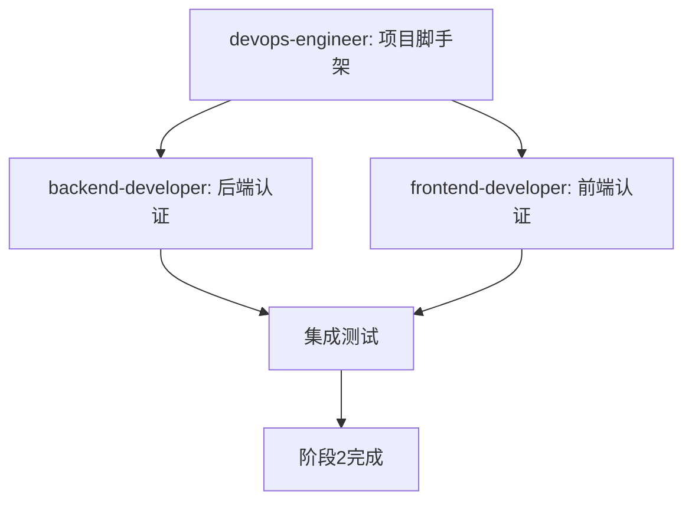

# 阶段2工作计划：用户认证与权限

**创建时间**: 2026-09-06  
**预计完成**: Week 3  
**状态**: 🟡 进行中

---

## 📋 目标

实现完整的用户认证与权限控制系统，为后续功能模块提供安全基础。

**对应需求**:
- REQ-01: 用户角色划分
- REQ-02: 权限控制
- 部分 REQ-18: 安全性（用户认证）

---

## 🎯 交付物清单

### 1. 项目脚手架（devops-engineer）

#### 后端项目结构
```
backend/
├── src/
│   ├── main/
│   │   ├── java/com/ticket/
│   │   │   ├── TicketSystemApplication.java
│   │   │   ├── config/
│   │   │   ├── controller/
│   │   │   ├── service/
│   │   │   ├── repository/
│   │   │   ├── model/
│   │   │   └── security/
│   │   └── resources/
│   │       ├── application.yml
│   │       └── application-dev.yml
│   └── test/
├── pom.xml
└── README.md
```

**技术栈**:
- Spring Boot 3.x
- Spring Security
- Spring Data JPA
- PostgreSQL
- JWT
- Lombok

#### 前端项目结构
```
frontend/
├── src/
│   ├── main.tsx
│   ├── App.tsx
│   ├── components/
│   ├── pages/
│   ├── services/
│   ├── store/
│   ├── types/
│   ├── utils/
│   └── styles/
├── package.json
├── tsconfig.json
└── vite.config.ts
```

**技术栈**:
- React 18
- TypeScript
- Vite
- React Router
- Ant Design
- Zustand
- Axios

#### Docker开发环境
- `docker-compose.yml`（PostgreSQL + Redis）
- `Dockerfile.backend`
- `Dockerfile.frontend`
- `.gitignore`（扩展版）
- `Makefile`

---

### 2. 后端认证模块（backend-developer）

#### Entity层
- `User.java` - 用户实体
- `Role.java` - 角色实体
- `UserRole.java` - 用户角色关联

#### Repository层
- `UserRepository.java`
- `RoleRepository.java`

#### Service层
- `UserService.java` - 用户管理
- `AuthService.java` - JWT认证
- `RoleService.java` - 角色权限

#### Controller层
- `AuthController.java`
  - POST `/api/auth/register` - 注册
  - POST `/api/auth/login` - 登录
  - POST `/api/auth/logout` - 登出
  - POST `/api/auth/refresh` - 刷新Token
  - GET `/api/auth/me` - 获取当前用户

#### Security配置
- `SecurityConfig.java` - Spring Security配置
- `JwtTokenProvider.java` - JWT工具类
- `JwtAuthenticationFilter.java` - JWT过滤器

#### 测试
- `UserServiceTest.java`
- `AuthServiceTest.java`
- `RoleServiceTest.java`
- `AuthControllerIntegrationTest.java`

**目标**: 单元测试覆盖率 ≥80%

---

### 3. 前端认证功能（frontend-developer）

#### 状态管理
- `stores/authStore.ts` - 认证状态管理

#### API服务
- `services/api.ts` - Axios配置
- `services/authService.ts` - 认证API封装

#### 页面组件
- `pages/Login.tsx` - 登录页
- `pages/Register.tsx` - 注册页

#### 路由配置
- `router/index.tsx` - 路由守卫

#### 工具函数
- `utils/token.ts` - Token管理
- `utils/auth.ts` - 权限检查

#### 测试
- `Login.test.tsx`
- `Register.test.tsx`
- `authStore.test.ts`

---

## 📊 依赖关系



**关键路径**: 
1. 项目脚手架必须先完成
2. 后端和前端可并行开发
3. 集成测试在两者完成后进行

---

## ✅ 验收标准

### 功能验收
- [ ] 用户可以成功注册账号
- [ ] 用户可以使用用户名/密码登录
- [ ] 登录后获得有效的JWT Token
- [ ] Token自动添加到后续请求的Header
- [ ] Token过期后自动跳转登录页
- [ ] 用户可以成功登出
- [ ] 未登录用户无法访问受保护页面
- [ ] 角色权限控制生效

### 技术验收
- [ ] 后端单元测试覆盖率 ≥80%
- [ ] 前端关键组件有测试
- [ ] 所有API接口符合设计文档
- [ ] 密码使用BCrypt加密存储
- [ ] JWT Token签名和验证正常
- [ ] CORS配置正确
- [ ] Docker环境可以一键启动

### 性能验收
- [ ] 登录响应时间 <500ms
- [ ] Token验证时间 <100ms
- [ ] 前端页面加载时间 <2s

---

## 🚧 风险与应对

### 风险1: JWT Token安全性
**描述**: Token泄露可能导致账号被盗用  
**应对**: 
- 使用HTTPS传输
- Token设置合理的过期时间（1小时）
- 实现Token刷新机制
- 添加RefreshToken（可选）

### 风险2: 跨域问题
**描述**: 前后端分离可能遇到CORS错误  
**应对**:
- Spring Boot配置CORS
- 开发环境使用代理
- 生产环境使用Nginx反向代理

### 风险3: 密码安全
**描述**: 弱密码可能导致账号被破解  
**应对**:
- 前端验证密码强度（至少8位，包含字母和数字）
- 后端二次验证
- 可选：添加密码复杂度要求

---

## 📅 时间规划

| 任务 | 负责人 | 工作量 | 状态 |
|------|--------|--------|------|
| 创建后端脚手架 | devops-engineer | 4小时 | 🟡 进行中 |
| 创建前端脚手架 | devops-engineer | 3小时 | 🟡 进行中 |
| Docker环境配置 | devops-engineer | 2小时 | 🟡 进行中 |
| 后端Entity + Repository | backend-developer | 3小时 | ⚪ 待开始 |
| 后端Service层 | backend-developer | 6小时 | ⚪ 待开始 |
| 后端Controller + Security | backend-developer | 5小时 | ⚪ 待开始 |
| 后端单元测试 | backend-developer | 4小时 | ⚪ 待开始 |
| 前端状态管理 | frontend-developer | 2小时 | ⚪ 待开始 |
| 前端API服务 | frontend-developer | 3小时 | ⚪ 待开始 |
| 前端登录/注册页面 | frontend-developer | 6小时 | ⚪ 待开始 |
| 前端路由守卫 | frontend-developer | 2小时 | ⚪ 待开始 |
| 前端组件测试 | frontend-developer | 3小时 | ⚪ 待开始 |
| 集成测试 | 全体 | 4小时 | ⚪ 待开始 |

**总工作量**: 约47小时（约1周）

---

## 🎉 完成标志

当满足以下条件时，阶段2视为完成：

1. ✅ 所有交付物已创建
2. ✅ 所有验收标准通过
3. ✅ 代码已提交到Git仓库
4. ✅ 文档已更新
5. ✅ 演示视频/截图已提供
6. ✅ 下一阶段任务已规划

---

## 📝 备注

- 本阶段不包含"忘记密码"功能（推迟到阶段8）
- 本阶段不包含OAuth第三方登录（可选功能）
- 重点是实现基础的用户名/密码登录
- JWT Token暂不实现黑名单机制（推迟到安全加固阶段）
