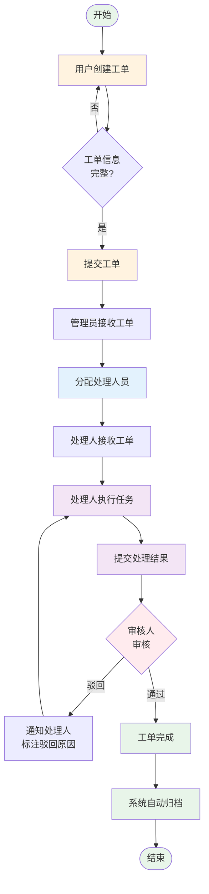

# 工单管理系统 - 用户需求说明书

**文档类型**: 用户需求说明书（User Requirements Document）  
**文档版本**: v2.0  
**创建日期**: 2026-09-06  
**更新日期**: 2026-09-06  
**基于**: 工单项目流程图.jpg  
**项目名称**: 工单管理系统  
**需求总数**: 18 条

---

## 目录

1. [项目概述](#1-项目概述)
2. [业务流程图](#2-业务流程图)
3. [用户角色定义](#3-用户角色定义)
4. [功能需求详细说明](#4-功能需求详细说明)
5. [非功能性需求](#5-非功能性需求)
6. [术语表](#6-术语表)
7. [验收标准](#7-验收标准)

---

## 1. 项目概述

### 1.1 项目背景

本系统基于《工单项目流程图》进行系统分析，旨在构建一个标准化的工单管理系统，支持工单从创建、分配、处理、审核到关闭的全生命周期管理，实现工作流程的数字化、规范化和可追溯化。

### 1.2 项目目标

- **规范化流程**：建立标准化的工单处理流程，明确各环节责任人和操作规范
- **提高效率**：通过系统自动化减少人工操作，缩短工单处理周期
- **全程追踪**：实现工单全生命周期的状态追踪和操作留痕
- **多角色协同**：支持创建者、处理人、审核人等多角色高效协作
- **数据分析**：提供统计报表，支持管理决策

### 1.3 核心价值

| 价值点 | 说明 |
|--------|------|
| 流程透明 | 工单状态实时可见，处理进度一目了然 |
| 责任明确 | 每个环节责任到人，操作可追溯 |
| 效率提升 | 自动分配、通知提醒，减少人工协调成本 |
| 质量保障 | 审核机制确保处理质量，驳回机制支持纠错 |
| 数据沉淀 | 历史数据支持分析和持续改进 |

### 1.4 业务阶段总览

本系统将工单全生命周期划分为 **5 个核心阶段**：

| 阶段 | 名称 | 核心活动 | 输出物 |
|------|------|----------|--------|
| **阶段1** | 工单创建 | 用户录入问题，提交工单申请 | 工单记录 |
| **阶段2** | 工单分配 | 管理员分配处理人员 | 分配记录 |
| **阶段3** | 工单处理 | 处理人员执行任务，提交处理结果 | 处理记录、附件 |
| **阶段4** | 工单审核 | 审核人员审核处理结果，通过或驳回 | 审核意见 |
| **阶段5** | 工单关闭 | 审核通过后关闭工单，归档 | 结案记录 |

---

## 2. 业务流程图

### 2.1 完整流程图



### 2.2 流程说明

#### 通过路径（正常流程）
1. 用户创建工单 → 提交 → 管理员分配 → 处理人执行 → 提交结果 → 审核通过 → 关闭归档

#### 驳回路径（异常流程）
- **审核驳回**：审核不通过 → 退回处理人 → 标注驳回原因 → 处理人重新处理 → 再次提交审核

#### 关键节点
- **判断节点1**：工单信息完整性校验（提交前）
- **判断节点2**：审核结果判断（通过/驳回）

---

## 3. 用户角色定义

系统共涉及 **6 类用户角色**，各角色权限遵循最小权限原则。

### 3.1 工单创建者

**角色类型**：普通用户

**职责描述**：
- 发现问题并录入系统，创建工单
- 填写工单详细信息（标题、描述、优先级等）
- 跟踪工单处理进度
- 查看处理结果和审核意见

**操作权限**：
- ✅ 创建工单
- ✅ 查看自己创建的工单
- ✅ 在工单被驳回时修改并重新提交
- ❌ 不能修改已提交的工单（非驳回状态）
- ❌ 不能查看其他人创建的工单

**典型场景**：
- 办公设备故障报修
- IT 技术支持请求
- 行政事务申请

---

### 3.2 处理人员

**角色类型**：执行人员

**职责描述**：
- 接收分配给自己的工单
- 执行工单任务，记录处理过程
- 提交处理结果和相关附件
- 根据驳回意见调整并重新提交

**操作权限**：
- ✅ 查看分配给自己的工单
- ✅ 更新工单处理进度
- ✅ 添加处理备注和附件
- ✅ 提交处理结果
- ❌ 不能查看未分配给自己的工单
- ❌ 不能删除工单

**典型场景**：
- 维修人员处理设备报修
- IT 工程师处理技术支持
- 行政人员处理事务申请

---

### 3.3 部门主管

**角色类型**：一级审核人

**职责描述**：
- 审核处理人员提交的处理结果
- 判断处理质量是否合格
- 填写审核意见（通过或驳回）
- 通过后流转至上级审批

**操作权限**：
- ✅ 查看本部门的所有工单
- ✅ 审核处理结果（通过/驳回）
- ✅ 填写审核意见
- ✅ 查看审核历史
- ❌ 不能直接修改工单内容

**审核重点**：
- 处理方案是否合理
- 处理结果是否符合要求
- 处理时效是否在期望范围内

---

### 3.4 分管领导

**角色类型**：二级审批人（可选）

**职责描述**：
- 对部门主管审核通过的工单进行复核
- 从管理层视角做出最终批准决定
- 重大工单或超预算工单的终审

**操作权限**：
- ✅ 查看所有工单
- ✅ 最终审批（批准/驳回）
- ✅ 查看完整审核链路
- ❌ 驳回直接退回至处理人

**审核重点**：
- 处理方案的必要性
- 资源投入的合理性
- 风险评估

---

### 3.5 系统管理员

**角色类型**：管理岗

**职责描述**：
- 分配工单给处理人员
- 管理用户和角色权限
- 配置系统参数（催办时限、通知规则等）
- 强制关闭异常工单

**操作权限**：
- ✅ 查看所有工单
- ✅ 分配/重新分配工单
- ✅ 强制关闭工单（需填写原因）
- ✅ 管理用户和权限
- ✅ 配置系统参数
- ✅ 导出统计报表

**典型场景**：
- 新工单的任务分配
- 处理人请假时的工单转移
- 重复工单的强制关闭

---

### 3.6 报表查看者

**角色类型**：只读用户（可选）

**职责描述**：
- 查看工单统计报表
- 分析工单处理效率
- 为管理决策提供数据支持

**操作权限**：
- ✅ 查看统计报表
- ✅ 导出报表数据
- ❌ 不能查看工单详情
- ❌ 不能执行任何操作

---

## 4. 功能需求详细说明

本章节按业务阶段逐条列出所有功能性用户需求，每条需求包含：需求编号、功能名称、责任角色、详细描述、业务规则与流转逻辑、优先级。

---

## 4.1 阶段一：工单创建

### REQ-01：工单信息录入

**责任角色**：工单创建者

**详细描述**：
- 系统提供工单创建界面，用户填写以下信息：
  - 工单标题（必填，最多100字符）
  - 问题描述（必填，支持富文本，最多2000字符）
  - 优先级（必填，可选：紧急/高/中/低）
  - 工单类别（必填，如：技术支持/设备报修/行政事务等）
  - 期望完成时间（可选）
  - 附件上传（可选，支持图片/文档，单个文件≤10MB，总数≤10个）
- 支持草稿保存功能，用户可暂存未完成的工单
- 支持从历史工单复制，快速创建相似工单

**业务规则与流转逻辑**：
- 标题、问题描述、优先级、类别为必填项，缺失则不允许提交
- 工单编号格式：`TK + YYYYMMDD + 4位序号`（如：TK202609060001），系统自动生成
- 提交后工单状态变更为 `待分配`
- 系统自动向管理员推送 `新工单待分配` 通知
- 创建时间自动记录，不可修改
- 创建后工单处于锁定状态，创建者不可直接修改（需等待驳回）

**优先级**：P0

---

### REQ-02：工单提交与校验

**责任角色**：系统自动

**详细描述**：
- 用户点击"提交工单"后，系统执行以下校验：
  - 必填字段完整性校验
  - 附件格式校验（允许：jpg/png/pdf/doc/docx/xls/xlsx）
  - 附件大小校验（单个≤10MB）
- 校验通过后生成工单记录，分配唯一编号
- 校验失败时显示具体错误提示，工单保持草稿状态

**业务规则与流转逻辑**：
- 校验失败时，用户可修改后重新提交
- 提交成功后，用户可在"我的工单"中查看工单状态
- 系统记录提交时间戳（精确到秒）

**优先级**：P0

---

## 4.2 阶段二：工单分配

### REQ-03：工单接收与查看

**责任角色**：系统管理员

**详细描述**：
- 管理员在"待分配工单"列表中查看所有新创建的工单
- 列表显示信息：工单编号、标题、优先级、创建人、创建时间、类别
- 支持筛选：按优先级、类别、创建时间范围筛选
- 支持排序：按创建时间、优先级排序
- 点击工单可查看完整详情（包含附件）

**业务规则与流转逻辑**：
- 待分配工单列表实时更新
- 紧急工单在列表中高亮显示（红色标记）
- 超过24小时未分配的工单自动发送催办提醒给管理员

**优先级**：P0

---

### REQ-04：分配处理人员

**责任角色**：系统管理员

**详细描述**：
- 管理员在工单详情页选择处理人员
- 处理人员列表显示：姓名、部门、当前工单数量、可用状态
- 支持按部门、专业领域筛选处理人员
- 可填写分配说明（可选，最多500字符）
- 支持一次分配给一个处理人（主处理人）
- 支持添加协作人员（可选，多选）

**业务规则与流转逻辑**：
- ✅ **分配成功**：
  - 工单状态变更为 `处理中`
  - 系统向处理人推送 `新工单分配` 通知
  - 系统向创建者推送 `工单已分配` 通知
  - 记录分配时间和分配人
- 必须选择至少一个主处理人，否则不允许提交
- 分配后管理员可重新分配（需填写原因）

**优先级**：P0

---

### REQ-05：自动分配规则（可选功能）

**责任角色**：系统自动

**详细描述**：
- 管理员可配置自动分配规则：
  - 按工单类别自动匹配处理人
  - 按处理人工作量均衡分配
  - 按优先级优先分配给高级处理人
- 自动分配后管理员可手动调整

**业务规则与流转逻辑**：
- 自动分配规则可开启/关闭（默认关闭）
- 自动分配失败时回退到手动分配
- 自动分配记录包含匹配规则说明

**优先级**：P2

---

## 4.3 阶段三：工单处理

### REQ-06：接收工单通知

**责任角色**：处理人员

**详细描述**：
- 处理人员收到工单分配通知（系统内消息）
- 在"我的工单"列表中查看分配给自己的工单
- 列表显示：工单编号、标题、优先级、创建人、期望完成时间、状态
- 支持按状态筛选（处理中/已提交/已驳回）

**业务规则与流转逻辑**：
- 通知在1分钟内送达
- 紧急工单通知带有特殊标识
- 处理人可查看工单完整详情和历史记录

**优先级**：P0

---

### REQ-07：工单处理与进度更新

**责任角色**：处理人员

**详细描述**：
- 处理人员在工单详情页执行以下操作：
  - 查看问题描述和附件
  - 添加处理备注（支持多次添加，每次备注带时间戳）
  - 上传处理过程附件（截图、日志等）
  - 更新处理进度百分比（0%-100%）
  - 记录实际工时（可选）
- 支持暂存，处理过程可分多次完成

**业务规则与流转逻辑**：
- 处理备注对创建者可见，实现实时沟通
- 每次更新进度时，系统自动通知创建者
- 处理过程中工单状态保持 `处理中`

**优先级**：P0

---

### REQ-08：提交处理结果

**责任角色**：处理人员

**详细描述**：
- 处理完成后，处理人员提交处理结果：
  - 处理说明（必填，最多2000字符）
  - 处理结果描述（必填）
  - 处理结果附件（可选，如截图、报告等）
  - 实际完成时间（自动记录）
- 提交前可预览处理结果
- 提交后不可直接修改（需等待审核驳回）

**业务规则与流转逻辑**：
- ✅ **提交成功**：
  - 工单状态变更为 `待审核`
  - 系统向审核人推送 `工单待审核` 通知
  - 系统向创建者推送 `工单已提交审核` 通知
  - 记录提交时间和处理人
- 处理说明和结果描述为必填项，缺失不允许提交
- 进度必须达到100%才能提交

**优先级**：P0

---

## 4.4 阶段四：工单审核

### REQ-09：审核工单列表

**责任角色**：部门主管

**详细描述**：
- 部门主管在"待审核工单"列表中查看所有待审核的工单
- 列表显示：工单编号、标题、处理人、提交时间、优先级
- 支持按优先级、提交时间排序
- 点击工单查看完整信息：
  - 原始问题描述
  - 处理过程备注
  - 处理结果说明
  - 所有附件

**业务规则与流转逻辑**：
- 待审核列表实时更新
- 超过3个工作日未审核的工单显示催办标识
- 紧急工单优先显示

**优先级**：P0

---

### REQ-10：审核处理结果

**责任角色**：部门主管

**详细描述**：
- 部门主管审核工单处理结果：
  - 查看处理说明和附件
  - 对比原始问题和处理结果
  - 填写审核意见（必填，最多1000字符）
  - 选择审核结果：通过 或 驳回
- 支持在线批注，标记问题点

**业务规则与流转逻辑**：
- ✅ **审核通过**：
  - 工单状态变更为 `已完成`
  - 系统向处理人推送 `工单审核通过` 通知
  - 系统向创建者推送 `工单已完成` 通知
  - 记录审核通过时间和审核人
  - 进入关闭流程
- ❌ **审核驳回**：
  - 工单状态变更为 `已驳回`
  - 系统向处理人推送 `工单被驳回` 通知，包含驳回原因
  - 处理人可查看驳回意见，修改后重新提交
  - 重新提交后状态变回 `待审核`
  - 记录驳回时间、驳回人和驳回原因
- 审核意见为必填项
- 驳回次数无上限，但每次驳回均记录在操作日志中

**优先级**：P0

---

### REQ-11：二级审批（可选）

**责任角色**：分管领导

**详细描述**：
- 对于高优先级或特定类别的工单，需要二级审批
- 部门主管审核通过后，流转至分管领导
- 分管领导可查看完整审核链路和所有历史记录
- 填写最终审批意见，选择批准或驳回

**业务规则与流转逻辑**：
- ✅ **批准**：工单状态变更为 `已完成`，进入关闭流程
- ❌ **驳回**：直接退回至处理人（不退回部门主管），状态变更为 `已驳回`
- 二级审批规则可配置：按优先级、按类别、按金额等
- 是否需要二级审批在工单创建时自动判断

**优先级**：P1

---

## 4.5 阶段五：工单关闭与归档

### REQ-12：自动关闭工单

**责任角色**：系统自动

**详细描述**：
- 审核通过后，系统自动执行关闭流程：
  - 工单状态变更为 `已关闭`
  - 工单进入锁定状态，不可再编辑
  - 生成工单结案记录，包含：
    - 工单编号
    - 创建人和创建时间
    - 处理人和处理时长
    - 审核人和审核意见
    - 完整的操作时间线
  - 工单自动归档至历史记录库

**业务规则与流转逻辑**：
- 系统向创建者、处理人推送 `工单已关闭` 通知
- 结案记录支持导出为PDF格式
- 归档数据保留不少于5年
- 关闭后的工单仅支持查看，不可修改

**优先级**：P0

---

### REQ-13：强制关闭工单

**责任角色**：系统管理员

**详细描述**：
- 管理员可强制关闭任意状态的工单
- 使用场景：
  - 重复工单
  - 无效工单
  - 用户撤销请求
  - 特殊情况取消
- 强制关闭需要填写关闭原因（必填，最多500字符）

**业务规则与流转逻辑**：
- 强制关闭后，工单状态变更为 `已取消`
- 系统向创建者、处理人推送 `工单已强制关闭` 通知，包含关闭原因
- 操作记录在审计日志中
- 强制关闭的工单也会归档，但标记为"非正常关闭"

**优先级**：P1

---

## 4.6 查询与统计

### REQ-14：工单查询

**责任角色**：所有角色（按权限）

**详细描述**：
- 各角色可查询与自己相关的工单：
  - 创建者：查看自己创建的工单
  - 处理人：查看分配给自己的工单
  - 审核人：查看待审核和已审核的工单
  - 管理员：查看所有工单
- 查询条件：
  - 工单状态（多选）
  - 优先级（多选）
  - 创建时间范围
  - 创建人/处理人（管理员可用）
  - 工单类别
  - 关键词搜索（标题、描述）
- 列表支持排序：按创建时间、优先级、状态
- 支持导出查询结果（Excel格式）

**业务规则与流转逻辑**：
- 查询结果按权限过滤，用户只能看到自己有权限的工单
- 查询条件支持组合，多条件AND关系
- 导出时包含当前筛选条件

**优先级**：P0

---

### REQ-15：工单详情查看

**责任角色**：所有角色（按权限）

**详细描述**：
- 点击工单可查看完整详情：
  - 基本信息：编号、标题、描述、优先级、类别、创建人、创建时间
  - 当前状态和处理进度
  - 分配信息：处理人、分配时间、分配说明
  - 处理记录：处理备注、进度更新、附件
  - 处理结果：处理说明、结果描述、附件
  - 审核记录：审核意见、审核结果、审核人、审核时间
  - 操作时间线（所有状态变更和关键操作）
- 所有附件支持在线预览和下载

**业务规则与流转逻辑**：
- 根据用户角色和工单状态，部分信息可能不可见
- 操作时间线按时间倒序显示
- 附件预览支持图片、PDF格式

**优先级**：P0

---

### REQ-16：统计报表

**责任角色**：管理员、报表查看者

**详细描述**：
- 系统提供以下统计报表：
  - **工单概览**：总数、待处理数、处理中数、已完成数、已取消数
  - **处理效率**：平均处理时长、平均审核时长、按时完成率
  - **人员工作量**：按处理人统计工单数量、处理时长
  - **优先级分布**：按优先级统计工单数量
  - **类别分布**：按工单类别统计数量
  - **驳回率分析**：总驳回次数、驳回率、驳回原因分类
  - **超期工单**：超过期望完成时间的工单列表
- 支持时间范围筛选（日/周/月/季/年/自定义）
- 报表支持导出为Excel/PDF格式
- 支持图表展示（柱状图、饼图、折线图）

**业务规则与流转逻辑**：
- 数据每小时自动更新
- 报表权限可独立配置
- 导出的报表包含生成时间和查询条件

**优先级**：P1

---

## 4.7 通知与提醒

### REQ-17：消息通知机制

**责任角色**：系统自动

**详细描述**：
- 系统在以下场景自动发送通知：
  - 工单创建：通知管理员
  - 工单分配：通知处理人和创建者
  - 进度更新：通知创建者
  - 提交审核：通知审核人和创建者
  - 审核通过：通知处理人和创建者
  - 审核驳回：通知处理人
  - 工单关闭：通知创建者和处理人
- 通知方式：
  - 系统内消息（必须）
  - 邮件通知（可配置）
  - 短信通知（可配置，仅紧急工单）

**业务规则与流转逻辑**：
- 系统内消息在1分钟内送达
- 邮件通知在5分钟内发送
- 用户可在个人设置中配置通知偏好
- 未读消息在界面上显示红点标识

**优先级**：P0

---

### REQ-18：催办提醒机制

**责任角色**：系统自动

**详细描述**：
- 系统自动监控工单处理时效，超时后发送催办提醒：
  - 待分配超过24小时：提醒管理员
  - 处理中超过期望完成时间：提醒处理人
  - 待审核超过3个工作日：提醒审核人
- 催办规则：
  - 首次超时：立即提醒
  - 持续超时：每24小时提醒一次
  - 超时7天：升级通知至上级领导

**业务规则与流转逻辑**：
- 催办时限可在系统参数中配置
- 紧急工单的催办时限缩短50%
- 催办记录在操作日志中留存

**优先级**：P1

---

## 5. 非功能性需求

### 5.1 性能需求

| 指标 | 要求 |
|------|------|
| 页面加载时间 | 首屏加载 ≤ 2秒（在百兆网络环境下） |
| 列表查询响应 | ≤ 1秒（1000条记录以内） |
| 文件上传速度 | 10MB文件上传完成 ≤ 10秒 |
| 并发用户数 | 支持 ≥ 200 并发用户 |
| 系统可用性 | ≥ 99.5%（年度） |
| 数据库查询 | 单次查询 ≤ 500ms |

### 5.2 安全需求

| 需求项 | 说明 |
|--------|------|
| 用户认证 | 支持用户名密码登录，密码采用BCrypt加密存储 |
| 登录保护 | 5次失败后锁定账号15分钟 |
| 会话管理 | 30分钟无操作自动登出 |
| 权限控制 | 基于角色的访问控制（RBAC），最小权限原则 |
| 数据传输 | HTTPS加密传输 |
| 操作审计 | 所有操作记录操作人、时间、IP地址，日志保留5年 |
| 附件安全 | 上传文件自动扫描病毒，禁止可执行文件上传 |
| 数据备份 | 每日自动备份，备份数据保留30天 |

### 5.3 可用性需求

| 需求项 | 说明 |
|--------|------|
| 界面语言 | 支持中文、英文切换 |
| 浏览器兼容 | 支持Chrome、Firefox、Edge、Safari最新两个版本 |
| 移动端适配 | 支持响应式设计，在手机、平板上正常使用 |
| 操作提示 | 关键操作有二次确认提示（删除、关闭等） |
| 错误提示 | 错误信息清晰明确，提供解决建议 |
| 在线帮助 | 每个页面提供操作指引和帮助文档链接 |
| 无障碍支持 | 符合WCAG 2.1 AA级标准（键盘导航、屏幕阅读器） |

### 5.4 兼容性需求

| 需求项 | 说明 |
|--------|------|
| 操作系统 | Windows 10+、macOS 10.15+、主流Linux发行版 |
| 浏览器 | Chrome 90+、Firefox 88+、Edge 90+、Safari 14+ |
| 移动设备 | iOS 13+、Android 9+ |
| 屏幕分辨率 | 最低支持1366×768 |

### 5.5 可维护性需求

| 需求项 | 说明 |
|--------|------|
| 日志记录 | 系统运行日志、错误日志、审计日志分类记录 |
| 配置管理 | 系统参数可通过配置文件或管理界面修改，无需重启 |
| 版本升级 | 支持平滑升级，升级过程不影响现有数据 |
| 数据迁移 | 提供数据导入导出工具 |
| 监控告警 | 支持系统运行状态监控，异常时自动告警 |

---

## 6. 术语表

| 术语 | 释义 |
|------|------|
| 工单 | 用户创建的问题记录或任务请求，包含问题描述、处理过程和结果 |
| 工单编号 | 系统自动生成的唯一标识，格式：TK+年月日+4位序号 |
| 工单创建者 | 发起工单的用户，可跟踪工单进度 |
| 处理人员 | 被分配负责处理工单的执行人员 |
| 审核人 | 负责审核工单处理结果的管理人员，可以是部门主管或分管领导 |
| 驳回 | 审核人认为处理结果不合格，退回给处理人重新处理 |
| 关闭 | 工单审核通过后进入的最终状态，不可再修改 |
| 强制关闭 | 管理员在特殊情况下将工单强制置为关闭状态 |
| 操作时间线 | 记录工单所有状态变更和关键操作的时间序列 |
| 催办 | 系统自动检测超时工单并发送提醒通知 |
| 归档 | 已关闭的工单移入历史记录库，仅供查询不可修改 |
| RBAC | 基于角色的访问控制（Role-Based Access Control） |
| P0/P1/P2 | 需求优先级：P0=必须实现，P1=重要，P2=建议 |

---

## 7. 验收标准

### 7.1 功能验收

- ✅ 所有P0优先级需求（REQ-01至REQ-18中的P0）必须完全实现
- ✅ 工单创建、分配、处理、审核、关闭流程完整闭环
- ✅ 驳回机制正常运作，驳回后可重新提交
- ✅ 权限控制准确，不同角色只能执行其权限范围内的操作
- ✅ 通知提醒及时送达，无遗漏

### 7.2 性能验收

- ✅ 页面加载时间、查询响应时间满足第5.1节要求
- ✅ 支持200并发用户同时在线，系统运行稳定
- ✅ 压力测试通过，无内存泄漏和性能瓶颈

### 7.3 安全验收

- ✅ 通过安全渗透测试，无高危和中危漏洞
- ✅ 密码加密存储，不能明文查看
- ✅ 操作日志完整记录，可追溯
- ✅ 权限隔离有效，跨权限访问被拒绝

### 7.4 易用性验收

- ✅ 用户无需培训可完成基本操作（创建、查询工单）
- ✅ 错误提示清晰，用户能理解并知道如何修正
- ✅ 移动端操作流畅，核心功能正常使用

### 7.5 兼容性验收

- ✅ 在Chrome、Firefox、Edge、Safari最新版本中功能正常
- ✅ 在1366×768及以上分辨率下界面显示正常
- ✅ 在iOS和Android移动设备上功能可用

---

## 附录

### A. 工单状态定义

| 状态代码 | 状态名称 | 说明 |
|----------|----------|------|
| draft | 草稿 | 工单正在编辑，尚未提交 |
| pending_assign | 待分配 | 工单已提交，等待管理员分配处理人 |
| processing | 处理中 | 已分配处理人，正在处理 |
| pending_review | 待审核 | 处理人已提交结果，等待审核 |
| rejected | 已驳回 | 审核不通过，需重新处理 |
| completed | 已完成 | 审核通过，等待关闭 |
| closed | 已关闭 | 工单已关闭，流程结束 |
| cancelled | 已取消 | 工单被强制取消 |

### B. 优先级定义

| 级别 | 名称 | 说明 | 建议响应时间 |
|------|------|------|--------------|
| urgent | 紧急 | 严重影响业务，需立即处理 | 2小时内响应 |
| high | 高 | 重要问题，优先处理 | 4小时内响应 |
| medium | 中 | 一般问题，正常处理 | 1个工作日内响应 |
| low | 低 | 次要问题，可延后处理 | 3个工作日内响应 |

### C. 工单类别示例

- 技术支持（软件问题、网络问题、系统故障）
- 设备报修（硬件故障、设备维护）
- 行政事务（办公用品申请、场地预约）
- 咨询问题（业务咨询、流程咨询）
- 投诉建议（服务投诉、改进建议）
- 其他

---

**文档结束**

---

**修订历史**：
- v2.0 (2026-09-06): 重大重构，参考湖北经济学院URD，增加需求编号、流程图、角色细化、驳回路径、优先级标识
- v1.0 (2026-09-06): 初始版本

### 3.1 工单创建模块

#### 3.1.1 创建工单
- **功能描述**: 用户可以创建新工单
- **必填字段**:
  - 工单标题
  - 工单描述
  - 优先级（紧急/高/中/低）
  - 工单类别
- **可选字段**:
  - 附件上传
  - 期望完成时间
  - 关联项目/模块
  - 标签

#### 3.1.2 工单提交
- **功能描述**: 提交工单后进入待分配状态
- **业务规则**:
  - 必填字段校验
  - 自动生成工单编号
  - 记录创建时间和创建人
  - 发送通知给管理员

---

### 3.2 工单分配模块

#### 3.2.1 手动分配
- **功能描述**: 管理员手动选择处理人
- **操作权限**: 仅管理员/审批人员
- **业务规则**:
  - 可选择一个或多个处理人
  - 分配后发送通知给处理人
  - 工单状态变更为"处理中"

#### 3.2.2 自动分配（可选功能）
- **功能描述**: 根据规则自动分配处理人
- **分配规则**:
  - 按工作量均衡分配
  - 按专业领域匹配
  - 按优先级分配

---

### 3.3 工单处理模块

#### 3.3.1 接收工单
- **功能描述**: 处理人查看分配给自己的工单
- **展示信息**:
  - 工单详细信息
  - 创建人信息
  - 优先级和期望完成时间
  - 附件和历史记录

#### 3.3.2 处理工单
- **功能描述**: 处理人执行工单任务
- **操作功能**:
  - 更新处理进度
  - 添加处理备注
  - 上传处理结果附件
  - 记录工时（可选）
  - 修改工单状态

#### 3.3.3 提交处理结果
- **功能描述**: 完成处理后提交结果
- **必填内容**:
  - 处理说明
  - 处理结果描述
- **业务规则**:
  - 提交后工单状态变更为"待审核"
  - 发送通知给审批人员和创建者

---

### 3.4 工单审核模块

#### 3.4.1 审核处理结果
- **功能描述**: 审批人员审核工单处理结果
- **审核选项**:
  - 通过：工单完成
  - 驳回：返回处理人重新处理
- **必填内容**:
  - 审核意见

#### 3.4.2 审核通过
- **业务规则**:
  - 工单状态变更为"已完成"
  - 发送通知给创建者和处理人
  - 记录完成时间

#### 3.4.3 审核驳回
- **业务规则**:
  - 工单状态变更为"驳回"或"处理中"
  - 注明驳回原因
  - 发送通知给处理人
  - 处理人可重新提交

---

### 3.5 工单关闭模块

#### 3.5.1 正常关闭
- **触发条件**: 审核通过后
- **业务规则**:
  - 工单状态变更为"已关闭"
  - 不可再编辑（仅可查看）
  - 归档到历史记录

#### 3.5.2 强制关闭
- **功能描述**: 管理员可强制关闭工单
- **使用场景**:
  - 重复工单
  - 无效工单
  - 特殊情况取消
- **业务规则**:
  - 需要填写关闭原因
  - 发送通知给相关人员

---

### 3.6 工单查询模块

#### 3.6.1 我的工单
- **创建者视角**: 查看我创建的工单
- **处理人视角**: 查看分配给我的工单

#### 3.6.2 全部工单
- **功能描述**: 管理员可查看所有工单
- **筛选条件**:
  - 工单状态
  - 优先级
  - 创建时间范围
  - 创建人/处理人
  - 工单类别
  - 关键词搜索

#### 3.6.3 高级搜索
- **功能描述**: 多条件组合查询
- **导出功能**: 支持导出查询结果（Excel/CSV）

---

### 3.7 通知提醒模块

#### 3.7.1 实时通知
- **通知场景**:
  - 工单被分配
  - 工单状态变更
  - 收到审核结果
  - 工单被驳回
  - 工单即将超期

#### 3.7.2 通知方式
- **系统内通知**: 站内消息
- **可选通知**: 邮件通知、短信通知（可选）

---

### 3.8 统计报表模块

#### 3.8.1 基础统计
- 工单总数
- 各状态工单数量
- 平均处理时长
- 超期工单统计

#### 3.8.2 分析报表
- 按时间段统计（日/周/月）
- 按处理人统计工作量
- 按优先级统计
- 按类别统计

---

## 4. 数据字段定义

### 4.1 工单主表（tickets）

| 字段名 | 数据类型 | 必填 | 说明 |
|--------|----------|------|------|
| ticket_id | INT | 是 | 工单ID（主键，自增） |
| ticket_no | VARCHAR(50) | 是 | 工单编号（唯一，如：TK202609060001） |
| title | VARCHAR(200) | 是 | 工单标题 |
| description | TEXT | 是 | 工单描述 |
| priority | ENUM | 是 | 优先级（urgent/high/medium/low） |
| category | VARCHAR(50) | 是 | 工单类别 |
| status | ENUM | 是 | 工单状态（见状态定义） |
| creator_id | INT | 是 | 创建人ID（外键） |
| assignee_id | INT | 否 | 处理人ID（外键） |
| reviewer_id | INT | 否 | 审核人ID（外键） |
| expected_finish_time | DATETIME | 否 | 期望完成时间 |
| actual_finish_time | DATETIME | 否 | 实际完成时间 |
| created_at | DATETIME | 是 | 创建时间 |
| updated_at | DATETIME | 是 | 更新时间 |
| closed_at | DATETIME | 否 | 关闭时间 |

### 4.2 工单处理记录表（ticket_logs）

| 字段名 | 数据类型 | 必填 | 说明 |
|--------|----------|------|------|
| log_id | INT | 是 | 记录ID（主键） |
| ticket_id | INT | 是 | 工单ID（外键） |
| user_id | INT | 是 | 操作人ID |
| action | VARCHAR(50) | 是 | 操作类型（create/assign/process/submit/approve/reject/close） |
| content | TEXT | 否 | 操作内容/备注 |
| old_status | VARCHAR(20) | 否 | 变更前状态 |
| new_status | VARCHAR(20) | 否 | 变更后状态 |
| created_at | DATETIME | 是 | 操作时间 |

### 4.3 工单附件表（ticket_attachments）

| 字段名 | 数据类型 | 必填 | 说明 |
|--------|----------|------|------|
| attachment_id | INT | 是 | 附件ID（主键） |
| ticket_id | INT | 是 | 工单ID（外键） |
| file_name | VARCHAR(255) | 是 | 文件名 |
| file_path | VARCHAR(500) | 是 | 文件路径 |
| file_size | INT | 是 | 文件大小（字节） |
| uploader_id | INT | 是 | 上传人ID |
| uploaded_at | DATETIME | 是 | 上传时间 |

### 4.4 用户表（users）

| 字段名 | 数据类型 | 必填 | 说明 |
|--------|----------|------|------|
| user_id | INT | 是 | 用户ID（主键） |
| username | VARCHAR(50) | 是 | 用户名（唯一） |
| password | VARCHAR(255) | 是 | 密码（加密） |
| real_name | VARCHAR(50) | 是 | 真实姓名 |
| email | VARCHAR(100) | 是 | 邮箱 |
| phone | VARCHAR(20) | 否 | 手机号 |
| role | ENUM | 是 | 角色（admin/reviewer/handler/creator） |
| department | VARCHAR(50) | 否 | 部门 |
| status | TINYINT | 是 | 账号状态（1启用/0禁用） |
| created_at | DATETIME | 是 | 创建时间 |

---

## 5. 工单状态定义

### 5.1 状态列表

| 状态代码 | 状态名称 | 说明 |
|----------|----------|------|
| pending_assign | 待分配 | 工单已创建，等待分配处理人 |
| processing | 处理中 | 已分配处理人，正在处理 |
| pending_review | 待审核 | 处理人已提交结果，等待审核 |
| rejected | 已驳回 | 审核不通过，需重新处理 |
| completed | 已完成 | 审核通过，工单完成 |
| closed | 已关闭 | 工单已关闭，流程结束 |
| cancelled | 已取消 | 工单被强制取消 |

### 5.2 状态流转图

```
待分配 (pending_assign)
    ↓
处理中 (processing)
    ↓
待审核 (pending_review)
    ↓
已驳回 (rejected) → 返回处理中
    ↓
已完成 (completed)
    ↓
已关闭 (closed)

任何状态 → 已取消 (cancelled) [管理员强制]
```

---

## 6. 业务规则

### 6.1 权限规则

#### 创建者权限
- 可以创建工单
- 可以查看自己创建的工单
- 可以对已完成工单进行评价（可选）
- 不能修改已提交的工单（除草稿状态）

#### 处理人权限
- 可以查看分配给自己的工单
- 可以处理工单和提交处理结果
- 可以添加处理备注
- 不能删除工单

#### 审批人/管理员权限
- 可以查看所有工单
- 可以分配工单
- 可以审核处理结果
- 可以强制关闭工单
- 可以查看统计报表

### 6.2 时效规则

#### 超期提醒
- 工单创建后24小时未分配：提醒管理员
- 工单分配后48小时未处理：提醒处理人
- 工单距离期望完成时间不足24小时：提醒处理人
- 工单超过期望完成时间：标记为超期

#### 自动升级（可选）
- 超期工单自动提升优先级
- 多次驳回的工单自动升级审批层级

### 6.3 数据规则

#### 工单编号规则
- 格式：TK + YYYYMMDD + 4位序号
- 示例：TK202609060001
- 每日从0001开始递增

#### 附件规则
- 单个文件不超过10MB
- 支持格式：图片（jpg/png/gif）、文档（doc/docx/pdf/txt）、压缩包（zip/rar）
- 单个工单附件总数不超过20个

---

## 7. 非功能需求

### 7.1 性能要求
- 工单列表加载时间 < 2秒
- 工单详情打开时间 < 1秒
- 支持并发用户数 ≥ 100
- 数据库查询响应时间 < 500ms

### 7.2 安全要求
- 用户密码采用加密存储（BCrypt/SHA256）
- 支持登录失败锁定机制（5次失败锁定15分钟）
- 支持操作日志审计
- 敏感数据传输采用HTTPS

### 7.3 可用性要求
- 系统可用性 ≥ 99.5%
- 支持数据备份和恢复
- 定期数据归档

### 7.4 兼容性要求
- 支持主流浏览器（Chrome/Firefox/Edge/Safari）
- 支持移动端响应式设计
- 支持移动端APP（可选）

---

## 8. 用户界面需求

### 8.1 主要页面

#### 8.1.1 工单列表页
- 显示工单列表（表格形式）
- 支持筛选、排序、搜索
- 显示关键信息：编号、标题、状态、优先级、创建时间、处理人
- 支持批量操作（可选）

#### 8.1.2 工单详情页
- 显示工单完整信息
- 显示处理历史记录（时间线形式）
- 显示附件列表
- 根据角色显示操作按钮

#### 8.1.3 创建工单页
- 表单形式
- 实时字段校验
- 支持附件上传
- 支持草稿保存

#### 8.1.4 统计看板页
- 显示工单统计数据
- 图表展示（柱状图、饼图、折线图）
- 支持时间范围选择

### 8.2 交互要求
- 操作确认提示（删除、关闭等）
- 操作结果反馈（成功/失败提示）
- 表单错误提示清晰
- 加载状态提示

---

## 9. 未来扩展功能（可选）

### 9.1 高级功能
- 工单模板功能
- 工单批量导入
- 自定义工作流
- SLA服务等级协议
- 工单评价和满意度
- 知识库关联
- 移动端APP

### 9.2 集成功能
- 邮件系统集成
- 企业微信/钉钉集成
- 第三方系统对接（API）

---

## 10. 验收标准

### 10.1 功能验收
- ✅ 所有必需功能正常运行
- ✅ 工单流程完整闭环
- ✅ 权限控制准确
- ✅ 通知提醒及时

### 10.2 性能验收
- ✅ 满足性能要求指标
- ✅ 压力测试通过

### 10.3 安全验收
- ✅ 通过安全测试
- ✅ 无重大安全漏洞

---

## 附录

### A. 优先级定义

| 级别 | 名称 | 说明 | 响应时间 |
|------|------|------|----------|
| urgent | 紧急 | 影响业务的严重问题，需立即处理 | 2小时内 |
| high | 高 | 重要问题，优先处理 | 4小时内 |
| medium | 中 | 一般问题，正常处理 | 1个工作日内 |
| low | 低 | 次要问题，可延后处理 | 3个工作日内 |

### B. 工单类别示例
- 技术支持
- 故障报修
- 需求变更
- 咨询问题
- 投诉建议
- 其他

---

**文档结束**
